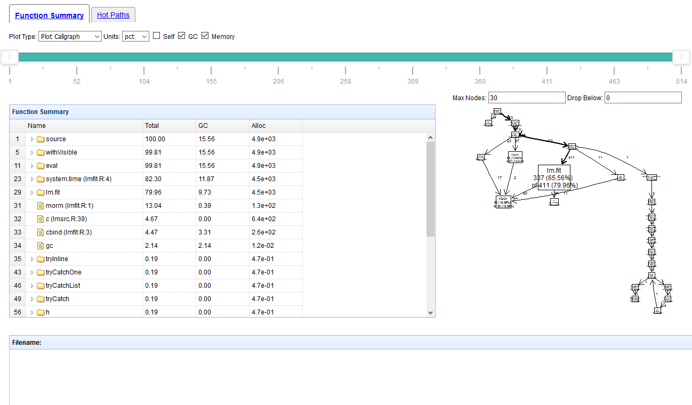
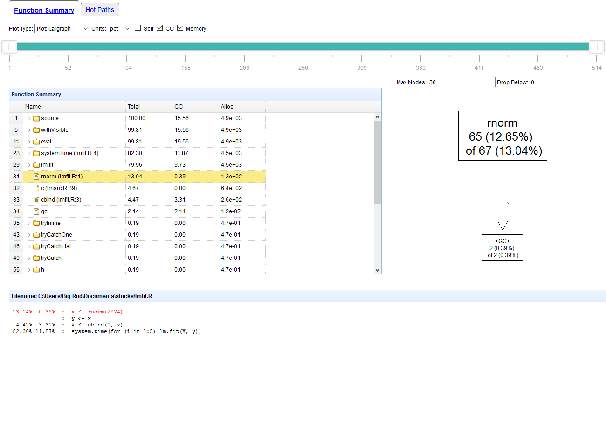
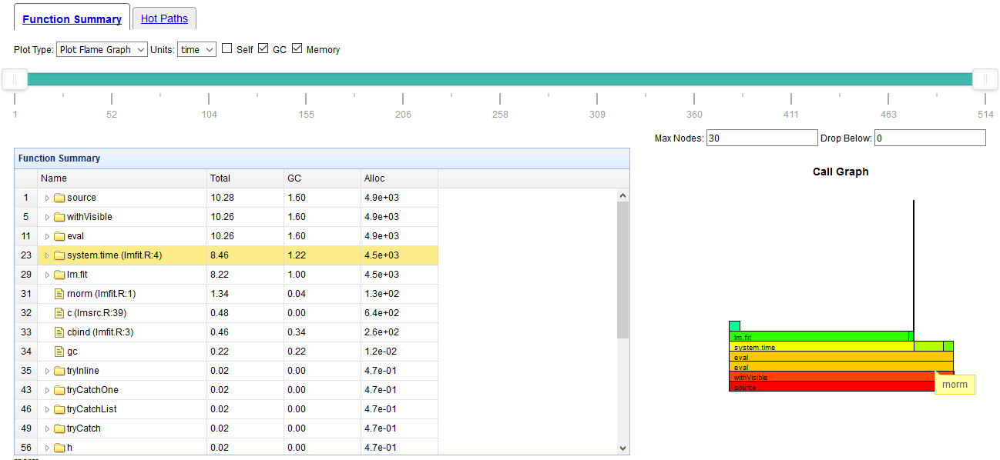
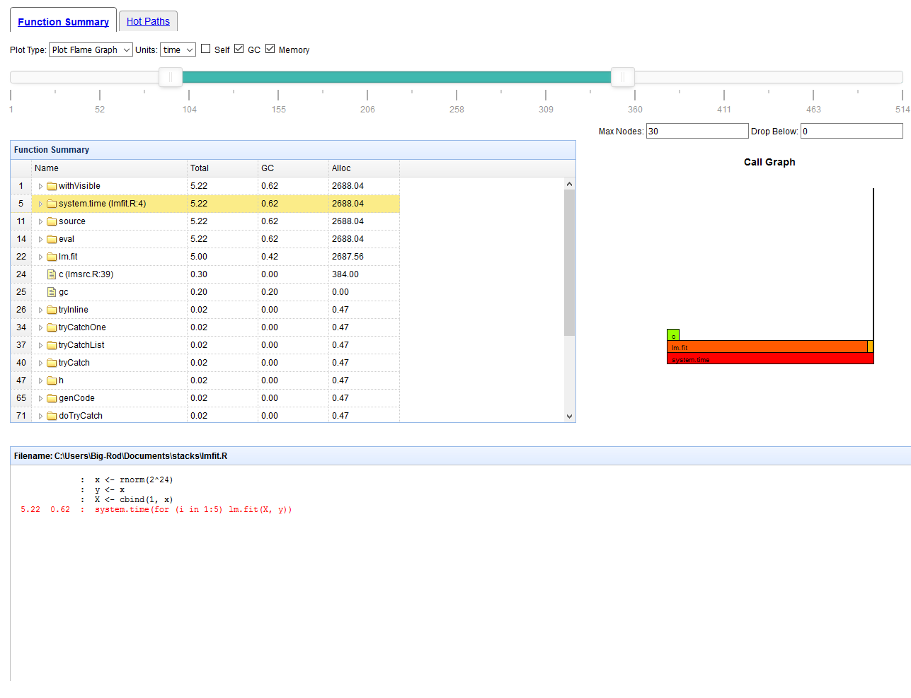
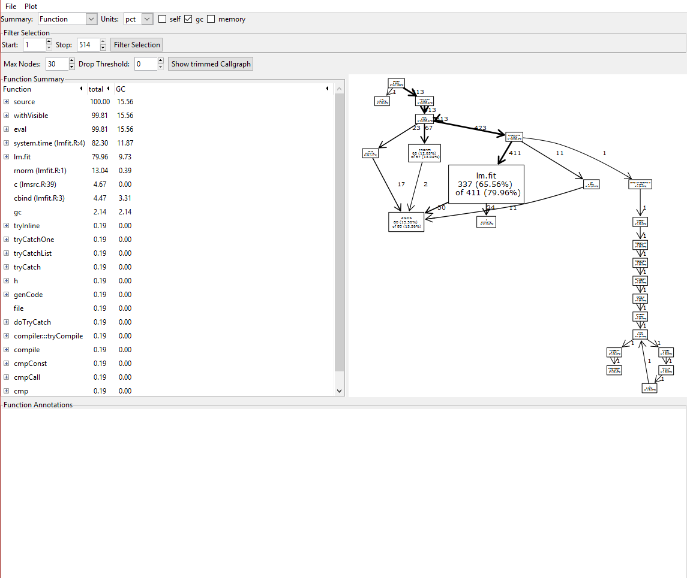

```{r setup, include = FALSE}
knitr::opts_chunk$set(
  collapse = TRUE,
  comment = "#>"
)
```

The proftools-GUI package provides a user interface to visualize and interact with much of the output from the proftools package. You can either use Shiny or the gWidgets package as the medium for the UI.

We can start by loading an example stack file:

`pd <- readProfileData(system.file("samples", "Rprof-lmfit-mem.out", package = "proftools-GUI"))`

## Shiny

We first illustrate the package use in Shiny. The `proftoolsGUI` function launches the UI with a set of initial options.

`proftoolsGUI(pd, method = "shiny", value = "pct", gc=TRUE, self= FALSE, memory=TRUE)`




\pagebreak

There are two main views that can be selected with the tabs at the top. The function summary view is the default, the alternative is the hotpaths view. 


Clicking on a function shows the source annotation in the bottom panel (with the corresponding line highlighted in red), and focuses the call graph on the selected function.  
You can also edit the options above the plot to cap the maximum number of nodes displayed or to drop nodes that appear infrequently. The latter can be done by specifying a threshold. Functions that appear in a number of stacks under that threshold are dropped.



\pagebreak

The options at the top of the panel can be adjusted to change the units, plots, or columns shown in the table. For instance, selecting the flame graph would plot it (focused on the selected function) and hovering the mouse  on the plot would display a tooltip listing the corresponding function.  



\pagebreak

We can also adjust the slider to focus on the selected time period. This adjusts the plots, table and annotation to reflect only the selected period.




\pagebreak

## gWidgets

Alternatively we can use the gWidgets package to perform the same operations

`proftoolsGUI(pd, method = "gwidgets", value = "pct", gc=TRUE, self= TRUE, memory=TRUE)`




The same operations performed in the Shiny view are possible here, with a few additional options in the file menu. Namely, you can use the file menu to select a stack (or R) file to profile, or even enter some R code and profile it on the spot.


